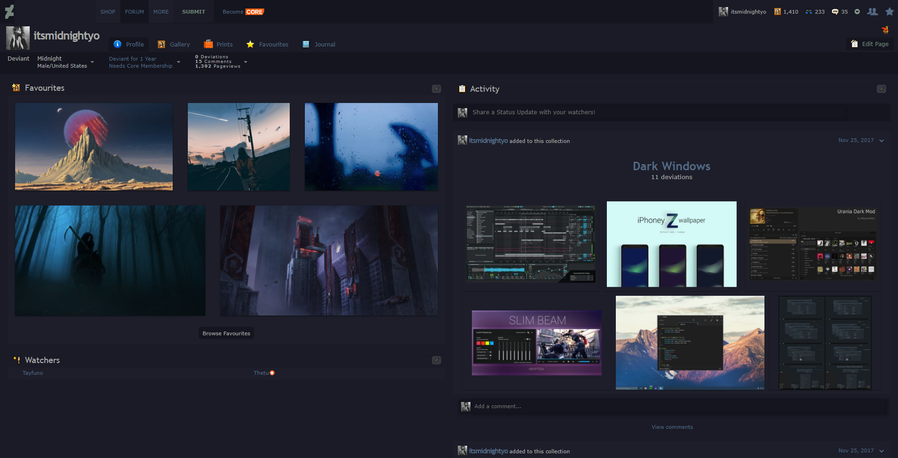

# DeviantArt [nocturnal css edits]
> updated dark theme for deviantart. originally created by [chloe chantelle] (@chloechantelle).

[chloe chantelle]: http://chloechantelle.com/

## Usage
Assuming you already have Stylish installed, go ahead and [install the original theme].

[install the original theme]: https://userstyles.org/styles/126711/nocturnal-deviantart-theme

## Import
> NOTE: the original theme is quite large so we'll be using an older extension for Chrome to overide the CSS.

Install [Stylebot] from the Chrome Web Store.

[Stylebot]: https://chrome.google.com/webstore/detail/stylebot/oiaejidbmkiecgbjeifoejpgmdaleoha

<details>
<summary>Afterwards, open the <a href="chrome-extension://oiaejidbmkiecgbjeifoejpgmdaleoha/options/index.html" target="_blank">extention's settings page</a>, and import the following JSON in the backup tab:</summary>

[json/import.json](json/import.json)

```json
{
    "deviantart.com": {
        "_enabled": true,
        "_rules": {
            "#browse-sidemenu ul li a": {
                "border-radius": "0px"
            },
            "#browse-sidemenu ul li a:hover": {
                "background": "#0e0f17",
                "color": "#555"
            },
            "#output>.browse-container.newbrowse .browse-left-bar": {
                "background-color": "#14151f"
            },
            ".artist-container .artist-actions .artist-devwatch a, .artist-container-full .artist-actions .artist-devwatch a, .artist-container .artist-actions .artist-view-link a, .artist-container-full .artist-actions .artist-view-link a": {
                "background": "linear-gradient(top, #e5ece3, #d9e4d7)",
                "border": "1px solid #14141b",
                "box-shadow": "inset 0 1px 0 #1d1e2a",
                "color": "#337287",
                "text-shadow": "0 1px 0 #14151f"
            },
            ".artist-container .artist-actions .artist-devwatch a.green, .artist-container-full .artist-actions .artist-devwatch a.green": {
                "background": "linear-gradient(top, #e8fb93, #c2ed6d) ",
                "border-color": "#344616 ",
                "box-shadow": "0 1px 0 #14151f ",
                "color": "#9ea790 ",
                "text-shadow": "0 1px 0 #14151f "
            },
            ".artist-container .artist-divider, .artist-container-full .artist-divider": {
                "border-bottom": "1px solid #1d1e2a",
                "border-top": "1px solid #1d1e2a"
            },
            ".artist-container .artist-info, .artist-container-full .artist-info": {
                "background": "#14151f",
                "border-top": "1px solid #14151f"
            },
            ".artist-container .deviations.torpedo-container, .collection-container .deviations.torpedo-container": {
                "background": "#14141b"
            },
            ".artist-container, .artist-container-full": {
                "background-color": "#1d1e2a",
                "border": "1px solid #1d1e2a",
                "border-bottom": "2px solid #14141b"
            },
            ".browse-result-summary": {
                "color": "#6d6f6f"
            },
            ".collection-container .deviations": {
                "background": "#070708",
                "border-top": "2px solid #2c3635"
            },
            ".collection-container, .collection-container-full": {
                "background": "#1d1e2a",
                "border-bottom": "1px solid #1d1e2a"
            },
            ".collection-container-inner": {
                "background": "#0f0f10",
                "border": "1px solid #2c3635"
            },
            ".collection-info": {
                "background": "#14151f",
                "border": "1px solid #14151f",
                "color": "#636c64"
            },
            ".empty-state .frames span": {
                "background": "transparent",
                "display": "none"
            },
            ".mini-show-more .mini-show-more-link, .show-more-container .show-more-button": {
                "color": "#5d5d5d",
                "text-shadow": "0 1px 0 #1d1e2a"
            },
            ".mlt-seed-border": {
                "background": "#14151f",
                "border": "1px solid #14151f"
            },
            ".plus-new-tab": {
                "background-color": "#14151f "
            },
            "hr.browse-divider": {
                "border-bottom": "1px solid #14151f",
                "border-top": "1px solid #14151f"
            },
            "#overhead .ntfirst, #overhead .ntmid, #overhead .ntlast": {
                "background-color": "#14151f",
                "background-image": "linear-gradient(0deg, #14151f, #14151f)"
            },
            "#overhead .ntlast": {
                "border-left": "1px solid #1d1e2a"
            }
        }
    }
}
```
</details>

## Screenshot
Although these edits mainly reflect the [watch page], here's what my profile page looks like:



[watch page]: https://www.deviantart.com/watch/

## Contributing
Feel free to make a pull request or open an issue with any changes you may have. ✨